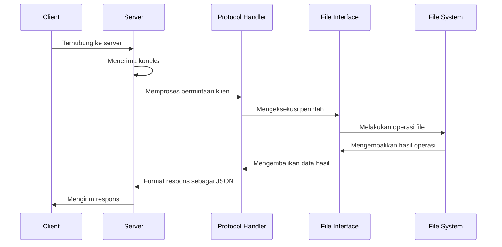

# Sistem File Server

Repositori ini berisi implementasi file server yang dibangun menggunakan pemrograman socket Python. Sistem ini memungkinkan klien untuk melakukan operasi file dasar (melihat daftar, mengunduh, mengunggah, menghapus) melalui protokol jaringan sederhana.

## Gambaran Arsitektur

Sistem file server mengikuti arsitektur client-server dengan komponen utama berikut:

1. **File Server** (`file_server.py`): Menangani koneksi klien dan memproses permintaan
2. **Penangan Protokol File** (`file_protocol.py`): Menginterpretasikan permintaan masuk sesuai dengan protokol yang ditentukan
3. **Antarmuka File** (`file_interface.py`): Mengeksekusi operasi file yang sebenarnya pada sistem file server
4. **Antarmuka Command Line Klien** (`file_client_cli.py`): Menyediakan antarmuka command-line bagi pengguna untuk berinteraksi dengan server

## Diagram Alur Sistem



## Spesifikasi Protokol

Protokol komunikasi berbasis teks dan mengikuti format ini:
- Klien mengirim: `PERINTAH [PARAMETER1] [PARAMETER2] ... \r\n\r\n`
- Server merespons dengan JSON: `{"status": "OK|ERROR", "data": ...} \r\n\r\n`

### Perintah yang Didukung

1. **LIST** - Mengambil daftar file yang tersedia
   - Permintaan: `LIST\r\n\r\n`
   - Respons: `{"status": "OK", "data": ["file1.txt", "file2.jpg", ...]}\r\n\r\n`

2. **GET** - Mengunduh file dari server
   - Permintaan: `GET namafile.txt\r\n\r\n`
   - Respons: `{"status": "OK", "data_namafile": "namafile.txt", "data_file": "konten_terenkode_base64"}\r\n\r\n`

3. **UPLOAD** - Mengunggah file ke server
   - Permintaan: `UPLOAD namafile.txt konten_terenkode_base64\r\n\r\n`
   - Respons: `{"status": "OK", "data": "File berhasil diupload"}\r\n\r\n`

4. **DELETE** - Menghapus file dari server
   - Permintaan: `DELETE namafile.txt\r\n\r\n`
   - Respons: `{"status": "OK", "data": "File berhasil dihapus"}\r\n\r\n`

## Detail Komponen

### File Server (`file_server.py`)

Komponen server memanfaatkan multi-threading untuk menangani beberapa koneksi klien secara bersamaan. Untuk setiap koneksi klien, sebuah thread baru (`ProcessTheClient`) dibuat untuk menangani komunikasi dengan klien tersebut.

Aspek kunci:
- Menggunakan socket TCP untuk komunikasi yang andal
- Mengimplementasikan threading untuk penanganan klien secara konkuren
- Memproses perintah dengan mendelegasikan ke penangan protokol
- Binding ke alamat IP dan port yang dapat dikonfigurasi (default: 0.0.0.0:6667)

### Penangan Protokol (`file_protocol.py`)

Komponen ini memproses perintah string yang masuk dan menerjemahkannya menjadi panggilan metode pada Antarmuka File. Ini menggunakan reflection (`getattr`) untuk memanggil metode yang sesuai secara dinamis berdasarkan perintah.

Aspek kunci:
- Mem-parsing string yang masuk menggunakan `shlex.split` untuk penanganan parameter yang tepat
- Mengkonversi perintah ke huruf kecil untuk pemrosesan yang tidak peka huruf besar/kecil
- Mengembalikan respons dalam format JSON

### Antarmuka File (`file_interface.py`)

Menyediakan implementasi sebenarnya dari operasi file pada sistem file server. Kelas ini:
- Mengatur direktori kerja ke folder khusus 'files/'
- Mengimplementasikan metode untuk melihat daftar, mendapatkan, mengunggah, dan menghapus file
- Menangani encoding/decoding base64 untuk transfer konten file
- Mengembalikan kamus respons standar untuk keberhasilan atau kegagalan

### Antarmuka Command Line Klien (`file_client_cli.py`)

Menyediakan antarmuka command-line bagi pengguna untuk berinteraksi dengan file server. Fungsinya meliputi:
- Menghubungkan ke server
- Mengirim perintah dan menerima respons
- Memproses konten file terenkode base64
- Mengimplementasikan fungsi untuk melihat daftar, mengunduh, mengunggah, dan menghapus file

## Konsep Pemrograman Jaringan

Implementasi ini menampilkan beberapa konsep kunci pemrograman jaringan:

1. **Pemrograman Socket**: Menggunakan library socket Python untuk membuat koneksi TCP antara klien dan server.

2. **Arsitektur Client-Server**: Mengimplementasikan model client-server klasik untuk aplikasi terdistribusi.

3. **Desain Protokol**: Mendefinisikan protokol berbasis teks sederhana dengan pola permintaan-respons, menunjukkan bagaimana protokol menyusun komunikasi jaringan.

4. **Serialisasi Data**: Menggunakan JSON untuk pertukaran data terstruktur dan encoding base64 untuk transfer konten file biner.

5. **Manajemen Koneksi**: Mendemonstrasikan cara membuat, mempertahankan, dan menutup koneksi jaringan.

## Model Konkurensi

Server menggunakan model konkurensi thread-per-klien:
- Setiap koneksi klien memunculkan thread baru
- Thread beroperasi secara independen untuk memproses permintaan klien
- Thread server utama terus menerima koneksi baru

Pendekatan ini memungkinkan beberapa klien dilayani secara bersamaan sambil mempertahankan pemisahan antara handler klien.

## Pengaturan dan Penggunaan

### Pengaturan Server

1. Buat direktori 'files' di lokasi yang sama dengan skrip server:
   ```
   mkdir files
   ```

2. Jalankan server:
   ```
   python file_server.py
   ```

### Penggunaan Klien

1. Konfigurasi alamat server dalam skrip klien (default adalah `172.16.16.102:6667`)

2. Jalankan operasi klien:
   ```python
   # Daftar file
   remote_list()
   
   # Unduh file
   remote_get('contoh.jpg')
   
   # Unggah file
   remote_upload('contoh.txt')
   
   # Hapus file
   remote_delete('contoh.txt')
   ```

## Penjelasan Detail Alur Sistem

1. **Inisialisasi Klien**:
   - Klien membuat socket dan terhubung ke alamat IP dan port server
   - Koneksi dibuat melalui TCP untuk komunikasi yang andal

2. **Pemrosesan Permintaan**:
   - Klien memformat string perintah dan mengirimkannya ke server
   - Server menerima perintah dan meneruskannya ke penangan protokol
   - Penangan protokol menguraikan perintah dan parameter
   - Antarmuka file mengeksekusi operasi yang diminta
   - Hasil dikembalikan melalui rantai sebagai JSON

3. **Penanganan Respons**:
   - Server mengirimkan respons JSON kembali ke klien
   - Klien memproses respons (misalnya, menyimpan file yang diunduh)
   - Koneksi tetap terbuka untuk perintah tambahan atau ditutup

4. **Operasi Konkuren**:
   - Sementara permintaan satu klien sedang diproses, server dapat menerima dan menangani koneksi klien baru
   - Setiap klien beroperasi di threadnya sendiri secara independen

## Kesimpulan

Sistem file server ini mendemonstrasikan konsep dasar pemrograman jaringan dan sistem operasi. Ini menyediakan implementasi sederhana namun fungsional dari sistem file terdistribusi dengan operasi dasar. Meskipun tidak siap untuk produksi karena keterbatasan keamanan, ini berfungsi sebagai contoh edukatif tentang arsitektur client-server, pemrograman socket, dan pemrosesan konkuren.